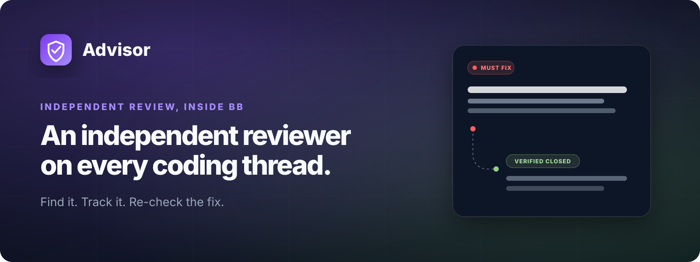
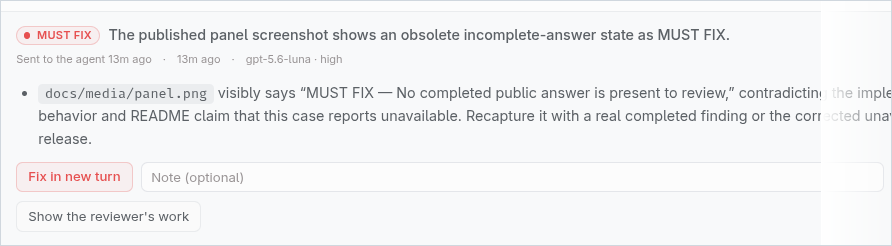
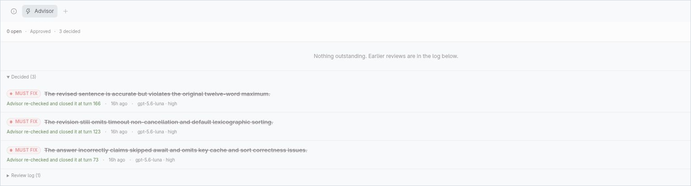
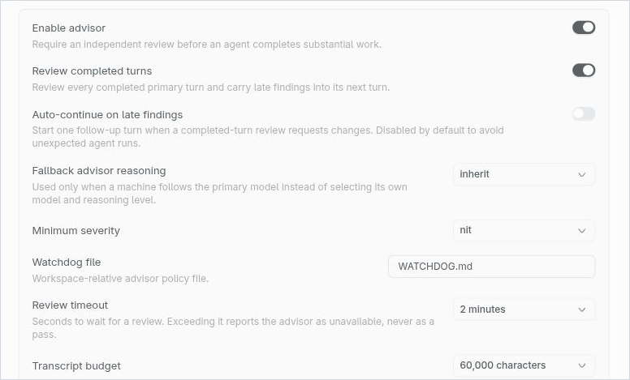
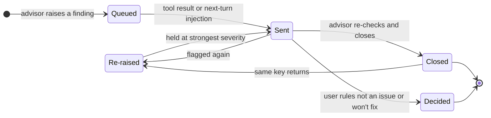
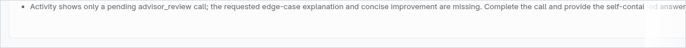

# Advisor

> A persistent, independent reviewer for bb coding threads.

[](https://github.com/salemsayed/bb-plugin-advisor/actions/workflows/ci.yml)
[](./LICENSE)
[](#install)

<p align="center">
  
</p>

Advisor pairs every coding thread with a second model that reviews the work —
before the agent finishes its answer, and again after the turn completes. The
reviewer runs in its own hidden thread with its own context, remembers what it
has already flagged, and escalates when the same defect comes back. A review
that cannot run reports as *unavailable*, never as approval.

<p align="center">
  <a href="https://cdn.jsdelivr.net/gh/salemsayed/bb-plugin-advisor@main/docs/media/advisor-promo.mp4"><strong>Play the 22-second demo →</strong></a>
  <br />
  <sub>Opens in your browser's video player with sound.</sub>
</p>

| Finding, evidence, and decisions | Re-checked and closed |
| --- | --- |
|  |  |

<sub>The finding on the left is real: while this release was being prepared,
Advisor reviewed the repository and flagged a stale screenshot in this very
README. It was recaptured — the screenshot above is the replacement.</sub>

## Why

An agent grading its own work has every incentive to pass it. Advisor adds an
outside opinion without changing bb core:

- **Independent.** Reviews run in a separate, hidden reviewer thread — a
  different context, optionally a different model per machine, spawned into the
  same environment so it can inspect the actual workspace.
- **Persistent.** Findings are chains with memory, not one-off comments. The
  same defect raised again joins its chain, counts as *re-raised*, and is held
  at its strongest severity — repetition means the agent was told and did not
  act, so a finding can escalate but never soften.
- **Fail-closed.** A timeout, a provider that cannot host a reviewer, or a
  reviewer that fails to start is reported as `Advisor unavailable` with the
  reason, and recorded as an incident. It is deliberately not a pass.

## How it works

Advisor reviews a thread through three complementary paths:

1. **`advisor_review` tool** — a mandatory agent tool for substantial work.
   The primary agent must call it once after implementation and verification,
   before its final answer. It runs a review-only pass in the reviewer thread
   and returns concrete findings the agent must address before completing.
2. **Post-turn review** — after a primary thread goes idle with a completed
   public answer, the reviewer checks that answer and the work it claims.
   Actionable late findings are injected into the next turn's dynamic
   instructions. A turn that already ran the tool is not reviewed again after
   it goes idle.
3. **Review now** — the thread panel can start the same review on demand. If
   the agent is still working, Advisor waits for the completed public answer
   instead of treating the missing answer as a finding.

The thread header advertises the review lifecycle independently from the agent
turn: **Waiting for completed turn**, **Review pending**, **Approved**,
**Changes requested**, or **Review unavailable**.

A late finding stays attached to the completed turn and offers **Fix in new
turn**, which starts an agent-only corrective follow-up with the finding
already in context. Unresolved findings are also injected when the user sends
the next message. When more than one finding is queued, Advisor carries the
whole bounded queue into that turn — delivering one finding never silently
consumes its siblings. Advice older than 24 hours is retired rather than
injected stale.

## Install

Requires bb ≥ 0.35.

From GitHub:

```sh
bb plugin install git:https://github.com/salemsayed/bb-plugin-advisor.git@main
```

From a local checkout:

```sh
bb plugin install . --yes
```

## Configure

All settings live in **Settings → Extensions → Advisor**.



| Setting | Default | Notes |
| --- | --- | --- |
| Enable advisor | on | Requires an independent review before an agent completes substantial work. |
| Review completed turns | on | Post-turn review; late findings carry into the next turn. |
| Auto-continue on late findings | **off** | See below. |
| Fallback advisor reasoning | inherit | Used only when a machine follows the primary model. |
| Minimum severity | nit | Findings below the threshold are not delivered to the agent. |
| Watchdog file | `WATCHDOG.md` | Workspace-relative reviewer policy file. |
| Review timeout | 2 minutes | 30 seconds to 10 minutes. Exceeding it reports unavailable, never a pass. |
| Transcript budget | 60,000 characters | 20,000 to 120,000. |

### Reviewer model, per machine

The model section loads the live provider/model catalog independently from
every connected bb machine. Selections are stored by stable host id, not as
one global model string. Each machine selection includes a reasoning level
populated from that model's live supported-reasoning metadata; choosing
"Model default" tracks the model's reported default.

At review time the plugin routes discovery through the primary thread's
environment and revalidates that machine's saved selection. A machine without
a selection follows the primary thread's provider and model. A disconnected
machine, a model that was removed, or a reasoning level the model no longer
supports also falls back to the primary model. The picker only offers
providers that can host a reviewer in one of the accepted permission modes,
and it never accepts models from an unverified fallback catalog returned after
a provider probe failure.

Falling back to the primary model is checked, not assumed: if the primary
thread's own provider cannot run a reviewer in any accepted mode and that
machine has no advisor model configured, the review reports as unavailable
instead of failing at spawn. A catalog that cannot be read is treated as
inconclusive, so a transient outage does not disable reviews.

### Auto-continue on late findings (off by default)

When enabled, Advisor starts the **Fix in new turn** follow-up without a
click: one corrective turn for a newly raised finding chain. It is idempotent
per review round and can fire only once per finding chain, so a persistent
finding cannot create an unattended review loop.

### Project reviewer policy

Place project-specific reviewer policy in `WATCHDOG.md` at the workspace root.
The reviewer reads it before each review; the filename is configurable.

## The life of a finding

The advisor assigns each finding a stable `key` naming the defect itself. A
later round carrying the same key joins that finding's chain even when it is
reworded or rated differently.



Every finding carries its own lifecycle, shown in the thread panel:

- **Queued** — found, but its text has not reached the primary agent yet.
- **Sent to the agent** — set at the two moments the finding is actually
  handed over: the tool result, and injection into the next turn's
  instructions. *Sent is not resolved* — it only means the agent has seen the
  text.
- **Re-raised N×** — the advisor flagged it again, so it demonstrably was not
  addressed.
- **Advisor re-checked and closed it** — the reviewer is shown its own open
  findings each round and may name keys on a `resolved:` line that it verified
  are fixed. Silence never closes anything, it cannot close a key it did not
  raise on this thread, and it cannot raise and close the same defect in one
  result. Closure is provisional: a later round of the same key reopens the
  chain, because a finding that comes back is a regression.
- **Decided by the user** — **Not an issue** or **Won't fix**, with an
  optional note, stored on the chain root. A user cannot self-certify a fix:
  **Fixed** is established only when a later Advisor round re-checks and
  closes the finding. (Existing legacy `fixed` decisions remain readable.) A
  user decision is authoritative — later matching rounds stay in history but
  never reopen it. Reopening clears the decision and any advisor closure
  together.

Findings resolved before decisions were recorded keep rendering as a plain
dismissal rather than being backfilled with a guess.

Matching normalized advice text is the fallback, used both when the advisor
supplies no key and when a keyed finding misses — which is how a chain that
predates keys stays continuous instead of splitting and softening on its first
keyed round. That fallback applies only above a length floor: terse generic
wording would otherwise merge unrelated findings and hand one an inherited
severity it never earned.

Reviews are persisted in the plugin's SQLite database, keyed by primary thread
and timeline sequence. Deleting a primary thread deletes its review history;
archiving keeps it.

<details>
<summary><strong>Reviewer evidence</strong> — every finding links to the reviewer's own workings</summary>
<br />



</details>

## When a review cannot run

When the advisor cannot run — the provider does not support the reviewer's
permission mode and no advisor model is configured, the reviewer thread fails
to start, the review exceeds the timeout, or the primary turn fails or ends
without a completed public answer — the tool reports `Advisor unavailable`
with the reason. No review row is recorded, and pending advice from an earlier
turn stays pending. A waiting **Review now** request is settled as unavailable
and can be retried instead of remaining stuck. Cancelling the primary turn
stops the reviewer thread.

## The reviewer thread

Reviewer threads are hidden and reused so the advisor keeps its own context. A
session is bound to the environment it was spawned into; if the primary thread
moves, the reviewer is respawned rather than left inspecting the old checkout.

The reviewer's permission mode is negotiated per review against what the
provider actually advertises, narrowest first: `readonly` when bb offers it,
otherwise `accept-edits`. Pinning either would be wrong — `readonly` reports
every review as unavailable on a bb released before that mode existed, and
`accept-edits` keeps handing the reviewer workspace write access on a bb that
has something narrower. A session spawned under a wider mode is retired rather
than reused once a narrower one becomes available, so upgrading bb tightens
the reviewer without any action.

When the provider catalog cannot be read, the mode is probed narrowest-first
rather than assumed: the reviewer asks for `readonly`, and only a refusal
moves it to `accept-edits`. A mode the host accepted before is tried first, so
the probe costs nothing on the common path. A transient outage therefore
neither disables reviews nor silently widens them.

## Inspect

```sh
bb advisor status [thread-id]
bb advisor reviews [thread-id]
bb plugin logs advisor -f
```

## Security and trust

> [!IMPORTANT]
> Like every bb plugin, Advisor is full-trust code: its server runs inside
> your bb server, not in a sandbox, with access to the plugin SDK, its own
> database, and thread orchestration. Read the source before installing —
> this repository is small on purpose.

The reviewer itself is constrained by the negotiated permission mode, with one
caveat: bb only gained a first-class `readonly` mode recently, so on an older
build the reviewer is a behavioural boundary rather than an enforced one — it
is instructed to use read-only operations and runs in the narrowest mode
available, but it is not sandboxed. The exact tool set exposed in a given mode
remains the provider's responsibility, so provider-specific non-workspace
capabilities must still be assessed by that provider.

## Development

Requires Node 22.

```sh
npm ci
npm run verify   # typecheck + tests + build
npm pack --dry-run
```

The GitHub Actions workflow runs the same typecheck, test, build, and package
checks on pushes to `main` and on pull requests.

## License

MIT © 2026 Salem Sayed Abdel Gawad. See [LICENSE](./LICENSE).
